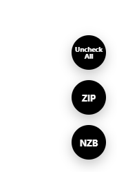

# EasyNews Sticky Buttons

A Chrome/Edge browser extension for `members.easynews.com` that adds persistent, floating **NZB**, **ZIP**, and **Uncheck All** buttons in the bottom-right corner of the page. Each button mirrors the site's own action, so you don't have to scroll back up to find it.

> 🤖 **Vibe coded.** This extension was built collaboratively with an AI coding assistant (Claude). It works, but review the source yourself before trusting it with anything sensitive.

## Features
- Floating NZB / ZIP / Uncheck All buttons that click the site's real buttons for you
- Buttons automatically enable/disable depending on whether the matching action is available on the page
- Options page to toggle each button on/off, set size, spacing, colors, and stacking order

## Install
1. Download the latest release from the [Releases page](https://github.com/gblachstein/EasyNews-Sticky-Buttons/releases) and unzip it.
2. Go to `chrome://extensions` (or `edge://extensions` in Edge).
3. Turn on **Developer mode**.
4. Click **Load unpacked** and select the unzipped folder (the one containing `manifest.json`).

## Configure
Right-click the extension icon and choose **Options** (or find it under `chrome://extensions` → Details → Extension options) to enable/disable individual buttons, adjust size/spacing/colors, and reorder them.

## Updating
After making local edits, click **Reload** on the extension card in `chrome://extensions`, then refresh the target site.
